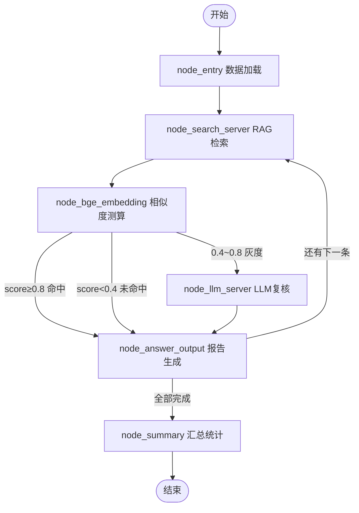

#RAG 检索质量评估系统
基于 LangGraph 构建的自动化 RAG 检索质量评估流程，采用 **BGE-M3 混合向量 + LLM 二级复核** 策略，逐条评估检索结果是否命中标准答案，最终输出每条判定结果与整体准确率。
## 项目思路
| 步骤 | 说明 |
|------|------|
| 1. 数据加载 | 从 `test_data/qa_pairs.json` 读取问题与标准答案 |
| 2. RAG 检索 | 调用检索服务获取每条问题的 top_chunk |
| 3. BGE-M3 相似度 | 用 BGE-M3 稠密向量计算 top_chunk 与 ground_truth 的余弦相似度 |
| 4. 三级路由 | ≥0.8 直接命中；<0.4 直接未命中；0.4–0.8 灰色地带交由 LLM 复核 |
| 5. LLM 复核 | 灰度区间条目由大模型综合判断是否命中并给出理由 |
| 6. 报告生成 | LLM 为每条生成可读评估理由，追加到 final_report |
| 7. 循环处理 | 逐条循环直到所有数据评估完毕 |
| 8. 汇总统计 | 计算 hit_count / total_count → accuracy_rate |
## 流程图

## 项目结构
```
xiaoduo/
├── main.py                         # 入口：调用 LangGraph 流程，输出 JSON 报告
├── pyproject.toml                  # 依赖配置（uv 管理）
├── .gitignore
├── test_data/
│   └ qa_pairs.json                 # 测试数据：问题 + 标准答案
├── search/
│   ├── ragServer.py                # RAG 检索服务（模拟）
│   └ test_data.json                # 检索结果：question + top_chunk
├── prompt/
│   ├── answer.prompt               # 报告生成提示词模板
│   ├── llm_eval.prompt             # LLM 复核提示词模板
│   └ llm_eval_system.prompt        # LLM 复核系统提示词
├── app/
│   ├── conf/
│   │   ├── lm_config.py            # LLM 配置（从环境变量读取）
│   │   └ embedding_config.py       # BGE-M3 配置
│   ├── core/
│   │   ├── load_prompt.py          # 提示词模板加载器
│   │   └ logger.py                 # 日志模块（loguru）
│   ├── process/agent/
│   │   ├── state.py                # EvaluationState TypedDict 定义
│   │   ├── main_graph.py           # LangGraph 状态图定义 + 条件路由
│   │   └ node/
│   │       ├── node_entry.py       # 节点：加载测试数据
│   │       ├── node_search_server.py   # 节点：调用 RAG 检索
│   │       ├── node_bge_embedding.py   # 节点：BGE-M3 相似度 + 三级路由
│   │       ├── node_llm_server.py      # 节点：LLM 二次复核
│   │       ├── node_answer_output.py   # 节点：生成报告 + 递增索引
│   │       ├── node_summary.py         # 节点：汇总准确率
│   ├── utils/
│   │   ├── normalize_sparse_vector.py  # 稀疏向量归一化工具
│   │   ├── format_utils.py             # 格式化工具
│   │   ├── path_util.py                # 路径工具
│   ├── tool/
│       └ download_bgem3.py             # BGE-M3 模型下载脚本
├── lm/
│   ├── lm_utils.py                 # LLM 客户端工具（ChatOpenAI）
│   └ embedding_utils.py            # BGE-M3 单例 + 向量生成
```
## 使用说明
### 1. 环境准备
- Python 3.11
- CUDA 12.4（BGE-M3 GPU 加速）
- [uv](https://docs.astral.sh/uv/) 包管理器
### 2. 环境变量
在系统环境变量中配置（不使用 `.env` 文件）：
| 变量名 | 说明 | 示例 |
|--------|------|------|
| `DASHSCOPE_API_KEY` | 阿里云 DashScope API Key | `sk-xxxxxx` |
| `OPENAI_API_BASE` | LLM API 地址 | `https://dashscope.aliyuncs.com/compatible-mode/v1` |
| `LLM_DEFAULT_MODEL` | LLM 模型名称 | `qwen-plus` |
| `LV_DEFAULT_MODEL` | 视觉模型名称（可选） | `qwen-vl-plus` |
| `LLM_DEFAULT_TEMPERATURE` | LLM 温度 | `0.1` |
| `HF_HOME` | HuggingFace 模型缓存目录 | `D:/ai_models/huggingface_cache` |
| `BGE_M3_PATH` | BGE-M3 本地模型路径（可选，无则自动下载） | `D:/ai_models/bge-m3` |
### 3. 安装依赖
```bash
uv sync
```
### 4. 运行评估
```bash
uv run python main.py
```
### 5. 输出结果
运行结束后生成 `output_report.json`：
```json
{
  "accuracy_rate": 0.8667,
  "detail": [
    {
      "question": "怎么申请退款？",
      "top_chunk": "在订单详情页点击申请退款...",
      "is_hit": true,
      "reasoning": "向量相似度>=0.8，语义高度一致，直接判定命中"
    },
    ...
  ]
}
```
## 核心设计要点
- **LangGraph 循环架构**：用 `current_index` + 条件路由实现逐条循环处理，避免批量并行带来的状态混乱
- **三级路由策略**：BGE-M3 相似度高分/低分直接判定，灰度区间交由 LLM 复核，兼顾效率与精度
- **BGE-M3 单例模式**：模型全局只初始化一次，失败后标记 `_bge_m3_init_failed` 防止反复重试
- **JSON 容错解析**：LLM 返回可能包含 markdown 或空白，使用 `re.search` 提取 JSON 块
- **SSL 旁路**：代理环境下 `httpx.Client(verify=False)` 解决证书验证问题
## 技术栈
- **LangGraph** — 流程编排与条件路由
- **BGE-M3 (FlagEmbedding)** — 稠密 + 稀疏混合向量
- **LangChain + ChatOpenAI** — LLM 调用
- **Milvus Model** — 向量编码与存储适配
- **Loguru** — 日志记录
